最近在做一个合作项目的时候接触到了远程遥控开关这个东西，它不需要编程只需要给好电源，按下遥控器按钮后接收端的对应引脚就会输出高电平，那有了这个电平信号的变化，我们用一个单片机来检测这个信号，就可以做任何想做的事情了，比如控制灯的亮灭，控制舵机的转动等简单或fu'z

# 调制方式

## ASK Amplitude Shift Keying

### OOK 通-断键控(属于ASK的一种)

以载波频率为基准，信号为1时输出，信号为零时不输出。

优点：简单、可靠、功耗低、成本低。

缺点：容易被干扰。

### 2ASK:幅度偏移

在ASK的基础上加上了幅值这一参数。

它包含了2bit的信息。

相同的载波频率下，改变幅值来实现数据的传递。

同理也存在 **QFSK QPSK**。

它俩改变的分别是更高的**频率**和更细节的**相位差**。

## FSK： Frequency Shift Keying 频率偏移

以载波频率为基准，在信号为1时偏移更高的频率，为0时偏移更低的频率。

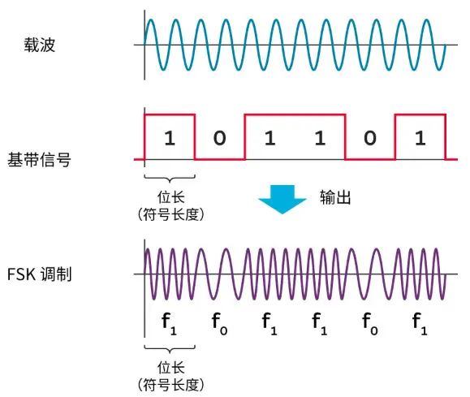

优点：抗干扰强、频谱利用率高且高效。

蓝牙的本质是使用FSK这种调制方法，实际是它的变种GFSK（高斯滤波FSK）。

## BPSK： Phase Shift Keying 相位偏移

以载波频率为基准，在信号为1时和载波形同，在信号为0时与载波偏移半个周期。

优点：发射功率高、抗干扰能力强、传输距离远。

## 正交振幅调制QAM([5G的核心技术](https://www.bilibili.com/video/BV1azGEzQEUf))

又能**调相**又能**调幅**。

PSK是最简单的QAM。

## 常见通信技术的调制参考

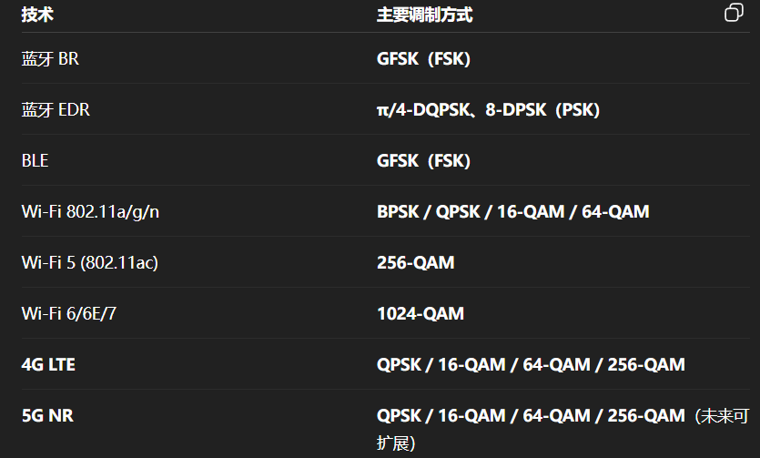

需要注意的是**wifi**和**4g 5g**这样的通信方式它是由**OFDM(多载波)** 和这些调制技术结合所产生的。

## 星座图

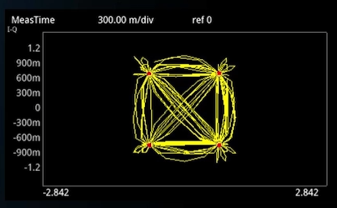

**调制方式**：根据星座图可以判断用的是FSK  PSK  QAM再或者是16QAM还是64QAM（这俩都是QAM的变种，就是对QAM进行调相和调幅分成更多的区间）。

**信号完整性**：信号受到干扰什么的能再这里体现出来。

**查看信号状态**：看星座图上的点来看出信号的幅度和相位。

**信号可靠性**：看星座图上点与点的距离来判断信号受到干扰后的可靠性。

# 编码技术

## 单片机模拟

使用单片机来模拟需要关注这几个参数**脉冲时间**、**数据码形**、**同步位码形**、**编码格式**。

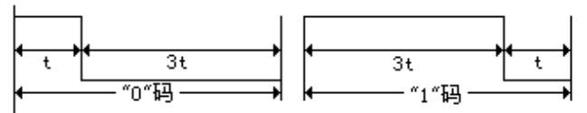

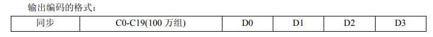

以上面这个编码格式为例。

**脉冲时间（t）**：一个电平脉冲所持续的时间。

**数据码形**：**“0”码**：一个脉冲时间的高电平三个脉冲时间的低电平   **“1”码**：三个脉冲时间的高电平一个脉冲时间的低电平  通过这种方式就组成了数据位的0和1。

**同步位码形**：1个脉冲时间的高电平加31个脉冲时间的低电平组成的。

这几个参数根据协议的不同也会发生变化可以参考下面代码的样式。

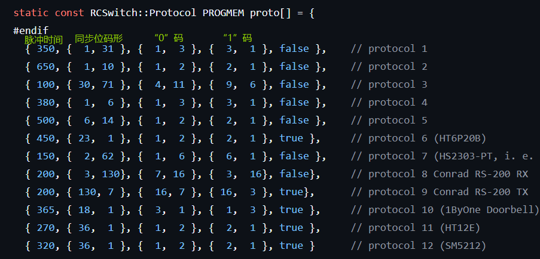

我们以第一个协议格式为例它的数据样式是这样的。

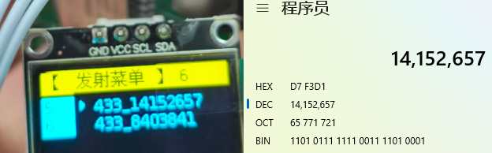

433_14152657这串名字是根据接收到的数据所命名的。

其中433指代的是通信频率433M，14152657是接收到的数据，这个数据是十进制的，转换成二进制为：

1101 0111 1111 0011 1101 0001

转换后的二进制是24bit的，前20个bit代表的是发送端的ID，后4个bit代表的是发送的数据，通过读取到的数据和数据手册中键位组合表就可以知道是哪个按键被按下。

比如这串数据的数据位为“0001”，在表中我们就可以知道是K0被按下后发送的数据。

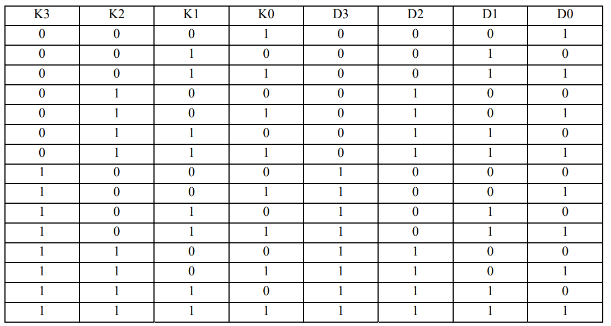

## 固定码

发送和接收所用的都是硬件编解码的方式，接收端的地址必须与发送端相同，芯片可以通过地址引脚对设备地址编码。

一般地址引脚和数据引脚总共有12个，同一系列的不同型号的芯片会分配不同数量比例的引脚。可参考下图

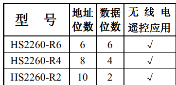

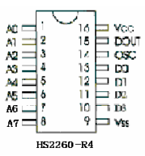

以HS2260A-R4这个芯片为例，由引脚图可知，其有8个地址引脚，4个数据引脚。

各引脚定义如下所示：

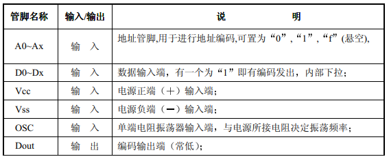

其中地址引脚可以读取**三种状态（1，0，悬空）**，它的每一个状态都需要**2bit**数据来表示。

那么它的编码方式如下图所示：

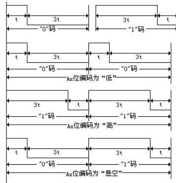

前面我们说过“0”码和“1”码，在这个基础上如果地址引脚接高电平，由上图可知在协议上就会发送一个二进制的“11”，低电平发送“00”，悬空发送“01”。

以下图数据为例：

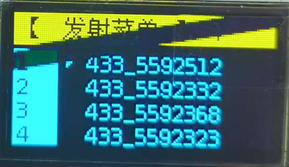

其中433是射频频率，后面的数字是获取到的数据的十进制格式。

分别将这四组数据翻译成二进制。

5,592,323 -> 0101 0101 0101 0101 0000 0011

5,592,332 -> 0101 0101 0101 0101 0000 1100

5,592,368 -> 0101 0101 0101 0101 0011 0000

5,592,512 -> 0101 0101 0101 0101 1100 0000

我们可以看到它的前十六位都是“01”，代表都是悬空的，而实际上它确实什么都没有接。

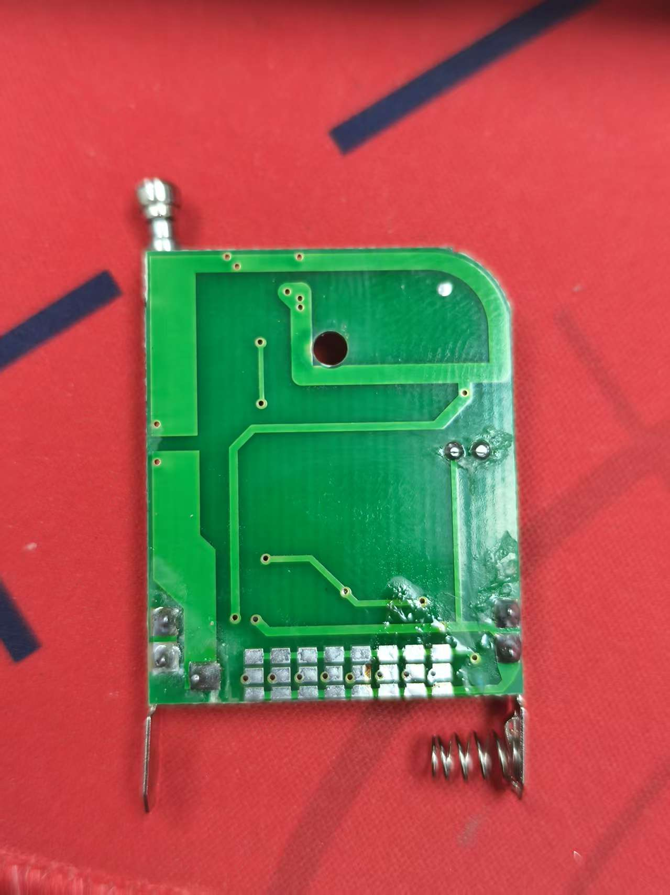

我把这个芯片的A0口**拉高**，A1口**拉低**。

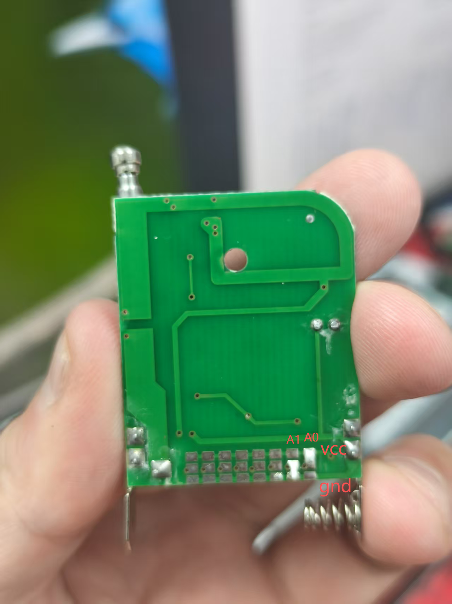

读取后的数据如下图所示：

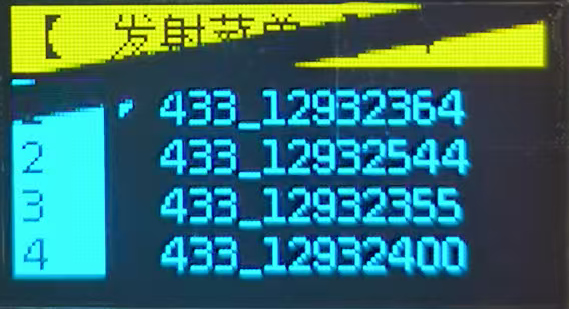

翻译后是这样的。

12,932,355 -> 1100 0101 0101 0101 0000 0011

12,932,364 -> 1100 0101 0101 0101 0000 1100

12,932,400 -> 1100 0101 0101 0101 0011 0000

12,932,544 -> 1100 0101 0101 0101 1100 0000

对比后可以发现第一第二位变成了“11“  第三第四位变成了”00“  其它位都是一样的。

所以固定码，是接收端固定只能接收与自己相同的地址的数据。

另外一个参数是脉冲时间，我们通过OSC1和OSC2引脚配置振荡器电阻以及改变电源电压就可以修改它脉冲时间。可以参考下图：
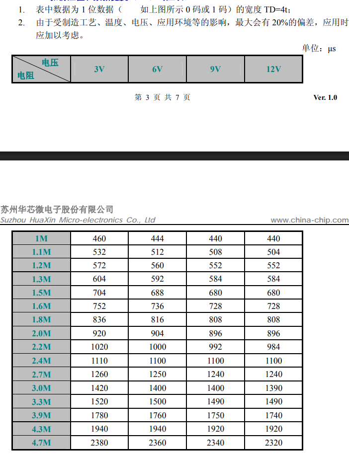

**芯片推荐**：hs2260（发送）hs2272（接收）

## 学习码

发射端在出厂前会预先烧录固定的ID，这个ID是不能够被更改的，接收端拥有记录学习功能，能够学习不同的遥控器的ID。如果遥控器丢失了，或者想要增添遥控器，只需要让接收端删除旧的ID记录新的ID就可实现控制功能。

学习码的编码格式与单片机模拟的编码格式相同，都是由20位的ID加4位的数据组成。

因为ID位足够多，就降低了重码的概率，但这个也并不绝对安全，单片机是可以模拟出这个数据格式的。

如果这个ID足够特殊的话，也是会与固定码的芯片重叠的。

**芯片推荐**：[ev1527](https://item.szlcsc.com/datasheet/eV1527/21878054.html?spm=sc.it.xds.a&lcsc_vid=RFcLU1BUTlkMUgEAQlVZBFxSRVdWVwVVTwNWXlIHQwMxVlNRR1FWUV1VTldXXjsOAxUeFF5JWBYZEEoBGA4JCwFIFA4DSA%3D%3D)（发送）、[fb1527](https://img.eecart.com/dev/file/part/spec/20240202/006a8c97e5574c4cad69c1dd9f607a9f.pdf)（发送）、[fj1527](https://item.szlcsc.com/datasheet/FJ1527-M3/5842847.html?spm=sc.it.xds.a&lcsc_vid=EwdZAQBUEQVXUlxREVQIUAZRFgUNVlMAEgVcX1cHFFMxVlNRR1BZUVxeQldYXjsOAxUeFF5JWBYZEEoBGA4JCwFIFA4DSA%3D%3D)（接收）

## 滚动码

[滚动码](https://blog.csdn.net/bashendixie5/article/details/135405871)，也叫跳跃码，是远程无钥匙进入系统中的一种安全技术

我们每次按下遥控器时都会生成一个新的发送数据

**大致实现原理**：发送设备内有一个计数器，当发送消息时计数器会随着+1，与序列号一起经过密钥加密后再加上键值数据一起发送。发送位数与密钥和计数器值等因素有关，也和不同厂家制定的编码协议有关。

接收端收到数据后解密得到数据，对比序列号和计数值来判断要不要相信这次数据，接收到的计数值应大于等于接收端的计数值。

# 相关资料

以[射频管家](https://oshwhub.com/ys-tao/shuang-pin-ye-pin-guan-jia-v1-3)硬件为基础的版本更迭[代码仓库](https://github.com/sprlightning/RF-Master)

缺少的[ESPAsyncWebServer](https://github.com/sprlightning/ESPAsyncWebServer)库

最新的[射频管家代码](https://github.com/zybaozi/RF_MANAGER)

以[ESP32-S3](https://docs.espressif.com/projects/esp-idf/zh_CN/stable/esp32s3/get-started/index.html)做的[射频遥控器](https://github.com/zhoushoujianwork/433_test_arduino)

[数字调制技术](https://article.murata.com/zh-cn/article/basics-of-digital-communication-2)

[关于数字调制的可视化视频](https://www.bilibili.com/video/BV1fGnRzsEms)

[蜂鸟无线](https://shop128000514.taobao.com/)

