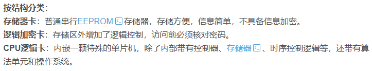
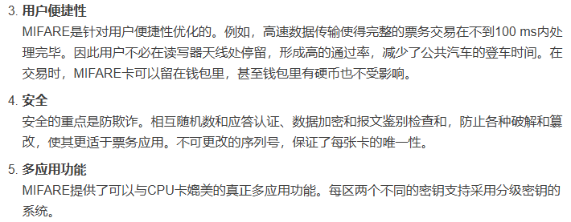

近距离无线通信

通信方式  点对点通信
通信速率  424Kbit/s（53KB/s）

| 卡片类型 | 工作频率     | 加密  | 市场占有率 |
| ---- | -------- | --- | ----- |
| ID卡  | 125kHz   | 非加密 | 主流    |
| IC卡  | 13.56MHz | 非加密 | 一般    |
| IC卡  | 13.56MHz | 非加密 | 主流    |
| IC卡  | 13.56MHz | 加密  | 一般    |
| IC卡  | 868MHz   | 加密  | 少     |

一般说IC卡都是指工作在13.56MHz频段的卡

# ID卡

工作频率：125kHz

用于记录卡号，读取卡号无任何限制，不能写入数据，内容由厂商写入

# IC 卡（ISO14443）

卡内记录的读取写入内容都要相应的密码认证，

包括 银行卡 门禁卡  公交卡  ETC卡

按读写通讯方式分：接触式、非接触式、双界面卡（同时具备接触式和非接触式通讯接口）

**接触式IC**：有外露的芯片引脚需要有硬件上的物理接触  比如银行卡 要有读卡器才能读取的

**非接触式IC**: 卡片内有埋藏的线圈，通过无线电波的形式读取数据  比如门禁卡  交通卡之类的

按结构分：

# RFID（射频识别）

非接触式的电子卡片或标签

IC卡  ID卡

也包括其它工作频段的电子卡/标签  比如915MHz  2.4GHz

NFC与RFID实际上式两个完全不同的领域

RFID属于识别技术  NFC属于通信技术

# Mifare卡

分为MF0、MF1、

## Mifare 1卡（简称M1卡）

工作频率：13.56MHz

传输速率：106kbit/s

高度数据完整性保护：16 Bit CRC，奇欧校验，位编码，位计数

分为S50和S70   50有1k存储空间   70有4K存储空间

非接触式逻辑加密卡  符合ISO/IEC14443A   通讯层为（MIFARE  RF  接口） 安全层支持域检验的CRYPTO1数据流加密

可进行无电源的数据传输  

防冲突  可同时操作读写范围内的多张卡，保证与选定的卡执行交易

# 硬件相关方案

## MFRC522

支持ISO/IEC 14443 FYPEA接口和MIFARE通信协议

## PN532

可读卡  也可模拟卡  以及nfc通信

有什么用：多协议NFC/RFID的读写+通信控制，产生13.56MHz的射频厂，和卡片和NFC设备完成调制、解调，处理底层协议，把结果以SPI/I2C/UART方式输出

## 变色龙（ChameleonMini）

