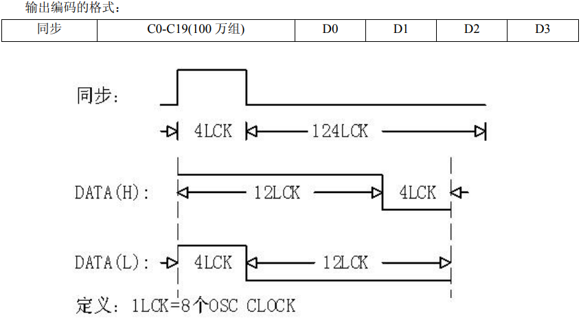
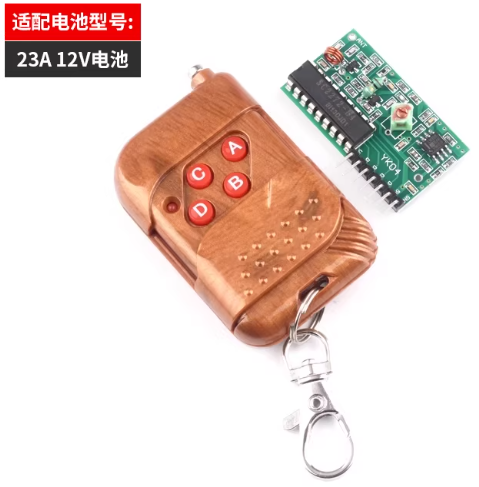
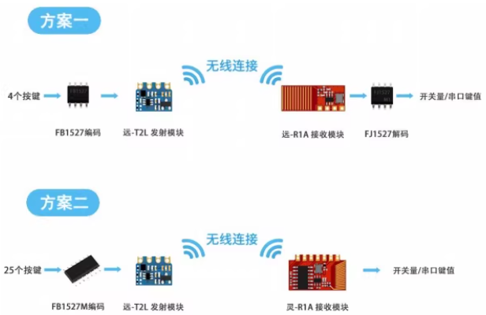
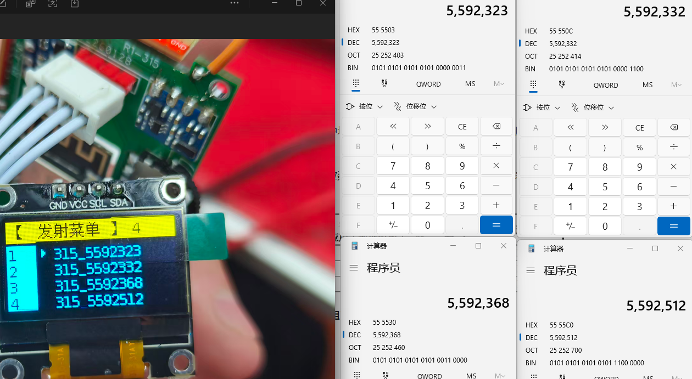
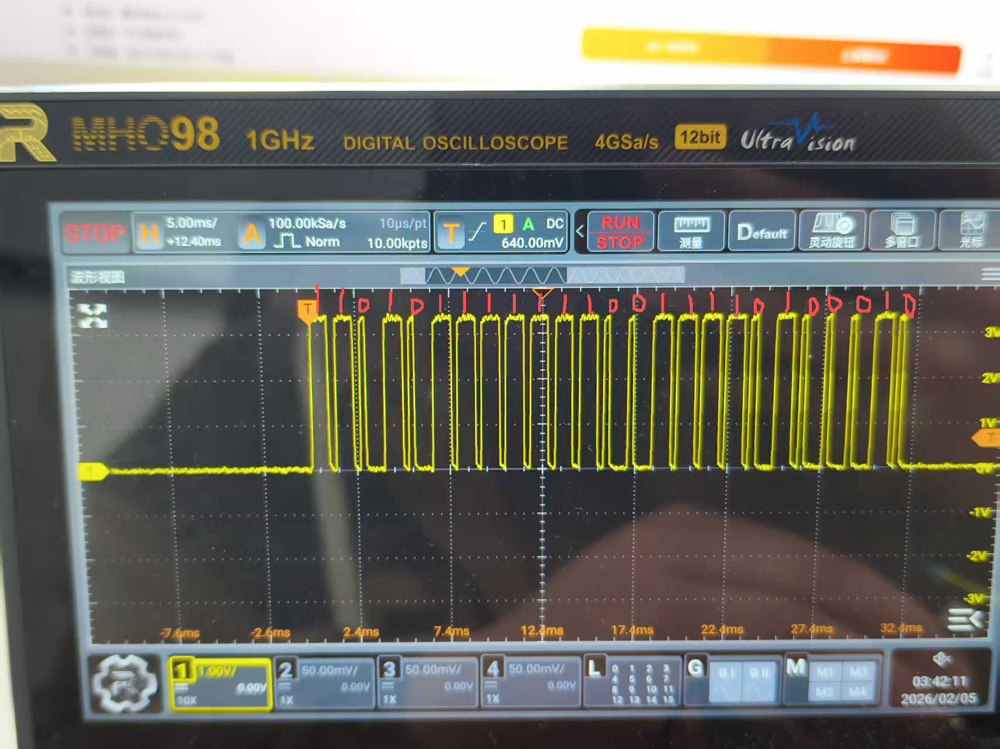
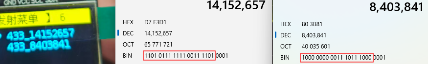

射频1527啦 2262什么其实不是射频的频率，这两个可以理解为不同的协议，而射频协议基本都是315或者433

# 433与315的区别

**传输效率**：433的频率更快  效率更高

**传输距离**：在相同发射功率下315的传输距离、穿透能力会更强一些，

**抗干扰**：都差不多，更多是取决于调制方式上

**功耗**：都差不多，主要还是芯片厂商的问题

**天线**：频率低的需要更长的天线才能保持稳定，315不适合做板载天线，433还是可以的

# 调制方式

## ASK Amplitude Shift Keying（OOK） 通-断键控(属于ASK的一种)

以载波频率为基准，信号为1时输出，信号为零时不输出，

优点：简单、可靠、功耗低、成本低

缺点：容易被干扰

## 2ASK:幅度偏移

在ASK的基础上加上了幅值这一参数

它包含了2bit的信息

相同的载波频率下，改变幅值来实现数据的传递，

同理也存在 **QFSK QPSK**

它俩改变的分别是更高的**频率**和更细节的**相位差**

## FSK： Frequency Shift Keying 频率偏移

以载波频率为基准，在信号为1时偏移更高的频率，为0时偏移更低的频率，

优点：抗干扰强、频谱利用率高且高效

## BPSK： Phase Shift Keying 相位偏移

以载波频率为基准，在信号为1时和载波形同，在信号为0时与载波偏移半个周期

优点：发射功率高、抗干扰能力强、传输距离远、

## DPSK: 差分相位键控

当信号为0时输出不变，当信号为1时对基波进行反相

## 正交振幅调制QAM([5G的核心技术](https://www.bilibili.com/video/BV1azGEzQEUf))

又能调相又能调幅

PSK是最简单的QAM

## 星座图

**调制方式**：用的是QFSK  QPSK  QAM再或者是16QAM还是64QAM（这俩都是QAM的变种，就是对QAM进行调相和调幅分成更多的区间）

**信号完整性**：信号受到干扰什么的能再这里体现出来

**查看信号状态**：看星座图上的电来看出信号的幅度和相位

**信号可靠性**：看星座图上点与电的距离来判断信号受到干扰后的可靠性

## IQ调制技术

[IQ调制解调](https://www.bilibili.com/video/BV1szNReYEer)

很干的[IQ调制基础理论](https://www.bilibili.com/video/BV19rU6B4Ed1)讲解

没看太懂

# 解码协议

## 单片机模拟解码协议

使用单片机来模拟需要关注这几个参数脉冲时间、数据码形、同步位码型

脉冲时间：

## 固定码

发送和接收所用的都是硬件解码的方式，其中地址是固定的，需要更改的话要对地址引脚进行配置。

地址位是使用芯片引脚进行配置，根据地址位数量的不同，所能够配置的地址数量也有差异可参考下图，

其中地址引脚可以读取**三种状态（1，0，高阻）**，所以它发送的每一位都需要**2bit**，

**芯片推荐**：hs2262（发送）hs2272（接收）

## 学习码

发送使用是编码芯片，解码使用对应硬件或mcu进行解码

使用学习码的芯片的ID在出厂时就会被固定下来，这里的学习指的是接收端会学习记录发送方的ID，如果有记录的ID他就接收，没记录的就不管。

其中发送的编码芯片的地址ID有20位，数据码位4位

补充：淘宝上的定制学习型的发射端，其实是依据芯片 、频率、电阻来进行配置的 芯片确认ID、频率确认调制频率、电阻确定脉冲宽度。（其实还有一个参数，输入电压，输入电压的不同也会影响脉冲宽度[振荡频率](https://item.szlcsc.com/datasheet/eV1527/21878054.html?spm=sc.it.xds.a&lcsc_vid=RFcLU1BUTlkMUgEAQlVZBFxSRVdWVwVVTwNWXlIHQwMxVlNRR1FWUV1VTldXXjsOAxUeFF5JWBYZEEoBGA4JCwFIFA4DSA%3D%3D)，这个参数随芯片厂商而定不一定都要参考，例如fb1527）

**芯片推荐**：[ev1527](https://item.szlcsc.com/datasheet/eV1527/21878054.html?spm=sc.it.xds.a&lcsc_vid=RFcLU1BUTlkMUgEAQlVZBFxSRVdWVwVVTwNWXlIHQwMxVlNRR1FWUV1VTldXXjsOAxUeFF5JWBYZEEoBGA4JCwFIFA4DSA%3D%3D)（发送）、[fb1527](https://img.eecart.com/dev/file/part/spec/20240202/006a8c97e5574c4cad69c1dd9f607a9f.pdf)（发送）、[fj1527](https://item.szlcsc.com/datasheet/FJ1527-M3/5842847.html?spm=sc.it.xds.a&lcsc_vid=EwdZAQBUEQVXUlxREVQIUAZRFgUNVlMAEgVcX1cHFFMxVlNRR1BZUVxeQldYXjsOAxUeFF5JWBYZEEoBGA4JCwFIFA4DSA%3D%3D)（接收，可以和fb1527进行[对码](https://www.semiee.com/file2/5842577d11f3665a362d0f772495ada6/Source30/Fengniao-FJ1527-M5N.pdf)，来保存发送设备ID）

## 滚动码

[滚动码](https://blog.csdn.net/bashendixie5/article/details/135405871)，也叫跳跃码，是远程无钥匙进入系统中的一种安全技术

我们每次按下遥控器时都会生成一个新的发送数据

大致实现原理：发送设备内有一个计数器，当发送消息时计数器会随着+1，与序列号一起经过密钥加密后再加上键值数据一起发送。

接收端收到数据后解密得到数据，对比序列号和计数值来判断要不要相信这次数据，接收到的计数值应大于等于接收端的计数值。

## 加密算法(还没了解)

Keeloq ，Hitag2

# 接收低功耗

接收芯片：[WS480L](https://item.szlcsc.com/datasheet/WS480L/3404128.html?spm=sc.it.xds.a&lcsc_vid=EwdZAQBUEQVXUlxREVQIUAZRFgUNVlMAEgVcX1cHFFMxVlNRR1BZX1NSQ1JfVjsOAxUeFF5JWBYZEEoBGA4JCwFIFA4DSA%3D%3D)
低功耗工作条件下：3.3V  3.4/3.8ma   12mw的功率
在休眠模式下： 0.01ua电流   从休眠模式启动时间3ms

从理论上来讲，可以有一套唤醒方案，接收端每200ms唤醒接收芯片等10ms看看有没有信号过来，如果有信号就接收信号，接收好后继续休眠，但这样的话就会导致发送方需要发送一段很长的先导信号，这个先导信号最好是要大于等于休眠时间+芯片启动时间的，这样不论在什么时候，接收芯片都能接收到发送的数据。

但这样也有坏处，就是发送端的发送时间会被拉长，并且不能使用固定的硬件作为发射端（发射信号不能进行编程，增添不了先导信号），不过功耗的事情还好，如果只是低频使用的话

所以如果想要接收端低功耗的话，我们就需要两边都是用单片机来进行协议的控制了，但既然都用单片机了，那么用低功耗蓝牙也不是不可以。

所以在我看来这个方案其实是有上位替代的，并且使用蓝牙协议抗干扰性也会更好（相比433/315这种射频方案来说）。

# 软硬件测试介绍

## 软件数据方面

使用[RCSwitch](https://github.com/sui77/rc-switch)库可以获取到别的同频设备发送的信息

**读数据**：发送的数据（这个数据是十进制的）

**bit**：协议的位数 这个码有多少位

**协议**：几号协议 可以理解为这个库能够解析哪[几种协议时序](https://github.com/sui77/rc-switch/blob/master/RCSwitch.cpp)

协议与时序和芯片的不同有比较大的关系，常见的协议大概有十一二个

## 硬件

### 通过硬件编解码发送接收

上图这种样式，发射端遥控器按钮和接收端io输出都是一一对应的关系，每个按键都会发送其固定的协议数据，这样的都是固定码的形式发送的协议。

而能买到的对拷型的遥控器是里面有一个能读取的单片机，通过射频的数据来记录这次数据后面就可以匹配按键来发送这个数据了（其实可以说它是一种学习码了）

### 硬件发送，硬件接收或软件接收

在通信方式上有两种方案
但发送端都是硬件发送的，接收可以用硬件解码，也可以使用软件解码

这种方案一般都是学习码的形式

一般学习码的解码芯片或模块都有对码功能（保存发送端的id）

### pcb板解读

在自己制作的硬件中核心为一个单片机和不同频率的发送和接收模块，单片机接收到接收模块发送的数据，使用[RCSwitch](https://github.com/sui77/rc-switch)库与库中记录的协议匹配解码，就可以解析出数据信息。

### 测试

同一个遥控器每个不同的键位对应的只有后8bit的数据不同（这个是固定码的地址位只有16位）

发送数据和测量到的数据（下面的是学习码的）

同一个厂家发送端是不同的ID（公司大厅灯的开关（左）公司实验室灯开关（右））（同样是学习码）

# 相关代码固件

以[射频管家](https://oshwhub.com/ys-tao/shuang-pin-ye-pin-guan-jia-v1-3)硬件为基础的版本更迭[仓库](https://github.com/sprlightning/RF-Master)

缺少的[ESPAsyncWebServer](https://github.com/sprlightning/ESPAsyncWebServer)库

最新的[射频管家代码](https://github.com/zybaozi/RF_MANAGER)

以[ESP32-S3](https://docs.espressif.com/projects/esp-idf/zh_CN/stable/esp32s3/get-started/index.html)做的射频读写[仓库](https://github.com/zhoushoujianwork/433_test_arduino)

# 技术文档
[数字调制技术](https://article.murata.com/zh-cn/article/basics-of-digital-communication-2)

[关于数字调制的可视化视频](https://www.bilibili.com/video/BV1fGnRzsEms)

# 淘宝无线店铺
[蜂鸟无线](https://shop128000514.taobao.com/)

